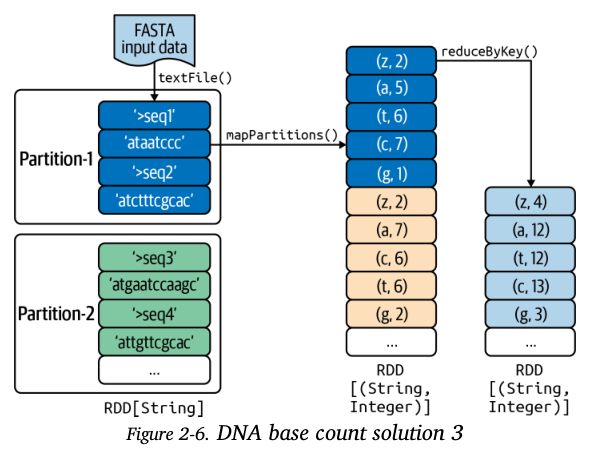

# Transformations in Action

When writing PySpark applications, there is a variety of arrangements of transformations and actions that can be selected to achieve the same result. However, it is important to note that not all these arrangements have the same performance. Therefore learning the common pitfalls to avoid and picking the right combinations has a significant effect on the performance of your application. 

## DNA Base Count Solution 1

Steps for solution 1:

1. read in FASTA input data
2. define a mapper function that transforms source RDD to target RDD in which each element is a tuple (dna_letter, 1)
3. Aggregate the sum of frequencies by grouping by dna_letter.

Concerns with solution
1. In step 2, we create a tuple `(dna_letter,1)` for each character in the sequence string. This places a high load on the network and prolongs shuffle time (?). Therefore, network is a bottleneck to scale the solution.
2. Consequently, the large number of tuples might lead to a memory issue - this can be adjusted by tweaking the RDDs *StorageLevel* from its default of *MEMORY_ONLY* to *MEMORY_AND_DISK*.

Things Learnt

1. `reduceByKey()` - merges the values for each unique key using an `associative and commutative` reduce function.
    - source and target RDD data types should be same.
2. `combineByKey()`
3. `RDD.collectAsMap()` - action that returns elements in rdd as a hash map.

## DNA Base count solution 2

This solution uses an `in-mapper combining optimization` - this will reduce the number of key pairs generated in step 2 from `solution 2`. The `(dna_letter, 1)` will be aggregated into a hash map and then flattened into a list and aggregated by dna_letter to find the count.

Solution 2
1. Read in FASTA data, creates an `RDD[String]` instance with each element being a FASTA record.
2. For every record, create a HashMap[dna_letter,frequency], then flatten the hash map with flatMap() into a list of key, value pairs.
3. For each DNA letter, aggregate and sum all the frequencies.

Positives with solution 2
- Reduces the number of pairs for each DNA sequence
- The reduction of pairs emitted reduces the strain on the network.
- No scalability since solution uses a `reduceByKey()` transformation

Concerns with solution 2
- solution still emits up to 6 keys pairs per DNA string
- For larger datasets or limited resources, solution would use too much memory. Why? This is because of the creation of a dictionary per DNA sequence

## DNA Base Count Solution 3
This solution makes use of the `mapPartitions()` transformation.

How does the `mapPartitions()` transformation work?

For a source RDD[T] and target RDD[U], mapPartitions transformation returns target RDD[U] by applying function f() to each partition of the source RDD[T]. function f(), takes in an iterator of type T and then returns type U.

This solution works with `partitions` - when data is represented in the RDD format, Spark automatically partitions RDDs and distributes these partitions across the available nodes. So rather than creating a dictionary for each dna record, solution 2, a dictionary is created per partition. Spark splits input data into partitions, and then executes computations on each partition independently and in parallel. With `mapPartitions()` transformation, source RDD is partitioned into *N* partitions (determined by available resources to the spark cluster) then each partition is passed into a function.

Positive of Solution 3
- emits a smaller number of key pairs than solution 1 and 2 - a dictionary is created per partition(rather than per fasta record) and then flattened into a list of key, value pairs.
- scalable since we use `mapPartitions()` to handle each partition and `reduceByKey()` to reduce all pairs emitted by each partition.

Concerns for solution 3
- use of custom code -but we will deal.

Things Learnt

**Summarization Design Pattern**

The `mapPartitions()` transformation is useful if you want to implement the summarization design pattern - get summary view of the data working with in order to to get insights not available by looking at localized records only. 
This pattern will involve grouping similar data together and performing an operation such as calculating a statistic, building an index, or simply counting. 

- when dealing with situations with large volumes of pairs,  `reduceByKey()` is more efficient than the `groupByKey()` transformation because of different shuffling algorithms (hmmm).

- Use the `mapPartitions()` transformation in situations where we want to extract and aggregate or derive a small amount of information - *summarization*

- aim for solutions that emit the lowest number of pairs as this improves performance of data solutions. By doing this you reduce the effort required for the **sort and shuffle phase** of spark application.