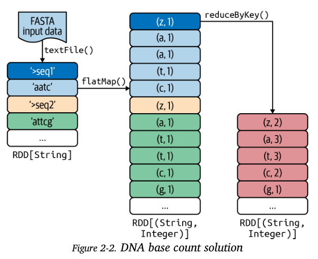
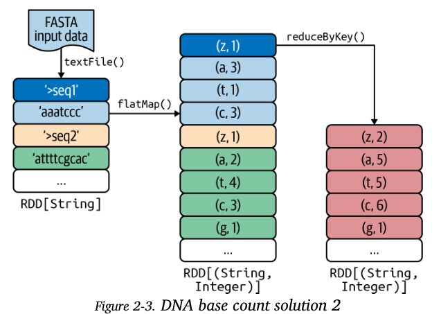

# Transformations in Action

When writing PySpark applications, there is a variety of arrangements of transformations and actions that can be selected to achieve the same result. However, it is important to note that not all these arrangements have the same performance. Therefore learning the common pitfalls to avoid and picking the right combinations has a significant effect on the performance of your application. 

## DNA Base Count Solution 1

Steps for solution 1:

1. read in FASTA input data
2. define a mapper function that transforms source RDD to target RDD in which each element is a tuple (dna_letter, 1)
3. Aggregate the sum of frequencies by grouping by dna_letter.

Concerns with solution
1. In step 2, we create a tuple `(dna_letter,1)` for each character in the sequence string. This places a high load on the network and prolongs shuffle time (?). Therefore, network is a bottleneck to scale the solution.
2. Consequently, the large number of tuples might lead to a memory issue - this can be adjusted by tweaking the RDDs *StorageLevel* from its default of *MEMORY_ONLY* to *MEMORY_AND_DISK*.

Things Learnt

1. `reduceByKey()` - merges the values for each unique key using an `associative and commutative` reduce function.
    - source and target RDD data types should be same.
2. `combineByKey()`
3. `RDD.collectAsMap()` - action that returns elements in rdd as a hash map.

## DNA Base count solution 2

This solution uses an `in-mapper combining optimization` - this will reduce the number of key pairs generated in step 2 from `solution 2`. The `(dna_letter, 1)` will be aggregated into a hash map and then flattened into a list and aggregated by dna_letter to find the count.

Solution 2
1. Read in FASTA data, creates an `RDD[String]` instance with each element being a FASTA record.
2. For every record, create a HashMap[dna_letter,frequency], then flatten the hash map with flatMap() into a list of key, value pairs.
3. For each DNA letter, aggregate and sum all the frequencies.
