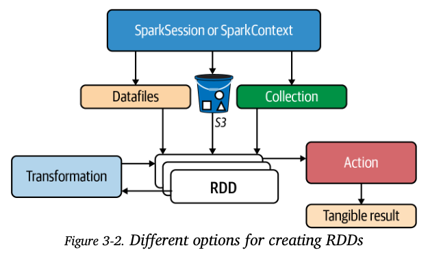
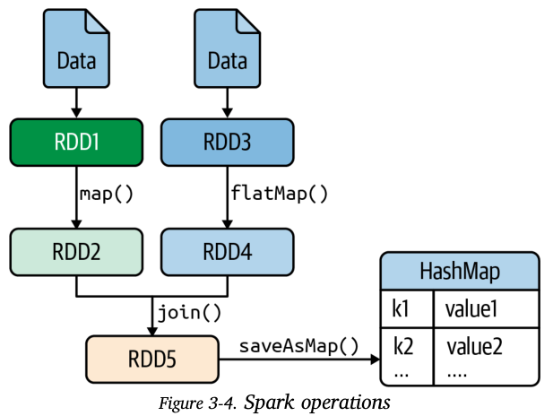

# Mapper Transformations

Mappers are functions that are used to process all the elements of a source RDD and generate a target RDD. That is, a mapper transforms a source `RDD[T]` into a target `RDD[V]` where `T` and `V` are the data types of the source and target RDDs, respectively. We look into the most common mappers that are used in building Spark applications.

Spark provides 5 key mapper transformations which are used a lot in RDD transformations.
1. `map(f)`: This is a `1-to-1` transformation where we return a new RDD by applying a function to each element in the source RDD. The source and target RDDs will have the same number of elements.
2. `mapValues(f)`: This is a `1-to-1` transformation where we pass each value (key, value) in the source RDD to a function without changing the keys. The source and target RDDs will have the same number of elements. `RDD[K,V] --> RDD[K,T]`
3. `flatMap(f)`: This is a `1-to-many` transformation where we return a new RDD by initially applying a function(`f()`) to all elements in the source RDD and then flattening the results. Source and target RDDs might contain different number of elements.  
4. `flatMapValues()`: This is a `1-to-many` transformation where we pass each value (key,value) pair RDD through a `flatMap()` function without changing the keys. Here the source and target RDDs might have different number of elements.
5. `mapPartitions(f)`: This is a `many-to-1` transformation where a new RDD is returned by applying a function (`f()`) to each partition of the source RDD. 

## Different options to create RDDs

**Directed Acyclic Graphs (DAGs) in Spark**

Spark uses DAGs to optimize its operations. Nodes or vertices are RDDs and edges represent the operation to be applied to the RDD. The DAG is created when running a Spark application. 

> Spark transformations are lazily evaluated, execution starts when an action is called. Optimizations can be made by Spark Engine after it has looked at DAG for the application. 

### map() transformation
This transformation is the most common in Spark and the MapReduce paradigm.
- 1 to 1 transformation: source rdd and target rdd will have the same number of elements.
- Not a sequential function, source RDD is partitioned into P partitions, which are processed independently and concurrently.
